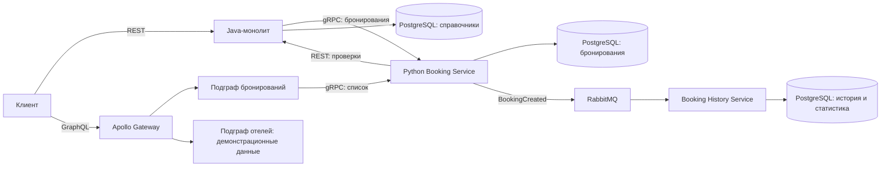
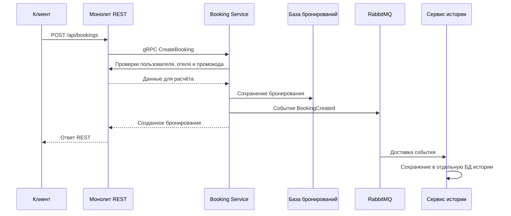
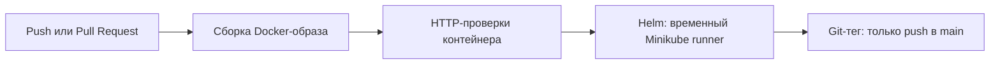
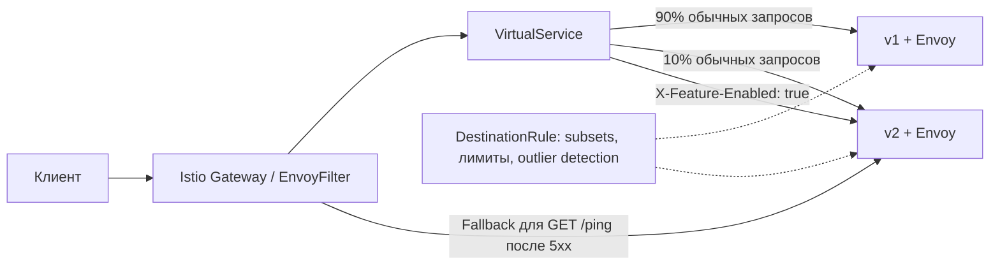

# Hotelio — сервис бронирования отелей

Учебный проект по постепенному выделению сервиса бронирования из Java-монолита. Пользователь создаёт бронирование и получает список своих бронирований; система проверяет пользователя, доступность отеля и промокод, рассчитывает цену и сохраняет историю событий.

Репозиторий показывает пять этапов: архитектурное решение, перенос бронирований в микросервис, единый GraphQL API, автоматизацию сборки и развёртывания, управление трафиком через Istio.

## Навигация

- [Архитектура и сценарий бронирования](#архитектура)
- [Быстрый запуск](#быстрый-запуск)
- [Проверка API](#проверка-api)
- [Kubernetes: task4 и task5](#kubernetes-task4-и-task5)
- [Структура репозитория](#структура-репозитория)
- [Стиль кода и проверки](#стиль-кода-и-проверки)
- [Ограничения реализации](#ограничения-реализации)

## Архитектура

Основной стенд запускается через [tasks/docker-compose.yml](tasks/docker-compose.yml). Монолит сохраняет REST API и данные пользователей, отелей, отзывов и промокодов. Создание бронирований проходит через внешний Python-сервис по gRPC. RabbitMQ передаёт события в отдельный сервис истории; GraphQL Gateway объединяет подграфы бронирований и отелей.





### Существующие бизнес-правила

- Пользователь должен быть активным и отсутствовать в чёрном списке.
- Отель должен работать, иметь доверенные отзывы и свободные места.
- Отель считается доверенным при среднем рейтинге не ниже 4 и количестве отзывов не менее 10.
- Базовая цена: 80 для VIP и 100 для остальных пользователей.
- Невалидный или отсутствующий промокод даёт нулевую скидку.
- Итоговая цена в существующем коде равна `base_price - discount`. Несмотря на имя поля `discount_percent`, значение вычитается как денежная сумма.
- История принимает `BookingCreated`; повторная запись с тем же идентификатором бронирования не добавляется.
- GraphQL-запрос списка требует заголовок `userid`, совпадающий с запрошенным `userId`.

### Технологии

| Компонент            | Реализация                            | Назначение                                         |
| -------------------- | ------------------------------------- | -------------------------------------------------- |
| Монолит              | Java 17, Spring Boot, Spring Data JPA | REST API и справочники                             |
| Бронирования         | Python 3.14, grpc.aio, HTTPX, psycopg | Проверки, расчёт и сохранение бронирований         |
| История              | Python 3.14, aio-pika, psycopg_pool   | Обработка событий и статистика                     |
| Обмен событиями      | RabbitMQ                              | Асинхронная доставка `BookingCreated`              |
| Хранилища            | PostgreSQL 15                         | Отдельные БД монолита, бронирований и истории      |
| GraphQL              | Node.js, Apollo Federation            | Общий API подграфов                                |
| Учебные HTTP-сервисы | Go, Docker, Helm                      | Практика CI/CD и маршрутизации                     |
| Service Mesh         | Istio и Envoy                         | Canary, маршруты по заголовкам, retries и fallback |

## Быстрый запуск

Команды ниже выполняются из корня репозитория на Ubuntu. Нужны Docker Engine с Compose v2, Bash и curl; для чтения JSON удобен jq. Python, Node.js и Java на машине для запуска через Docker не требуются.

### 1. Подготовить сеть и собрать сервисы

```bash
docker network inspect hotelio-net >/dev/null 2>&1 || docker network create hotelio-net
docker compose -f tasks/docker-compose.yml up -d --build
docker compose -f tasks/docker-compose.yml ps -a
```

Compose запускает базы данных, RabbitMQ, монолит, сервис бронирований, сервис истории и три GraphQL-компонента. Задание `monolith-seed` загружает [тестовые данные](test/init-fixtures.sql); его успешное завершение с кодом `0` нормально. Остальные приложения должны оставаться запущенными.

Для диагностики запуска:

```bash
docker compose -f tasks/docker-compose.yml logs --tail=80 monolith booking-service booking-history-service apollo-gateway
```

При первом запуске нужно дождаться готовности монолита и остальных сервисов. Если Gateway завершился до готовности подграфов, после их запуска выполните:

```bash
docker compose -f tasks/docker-compose.yml up -d apollo-gateway
```

### 2. Адреса стенда

| Интерфейс            | Адрес на Ubuntu          | Примечание                                 |
| -------------------- | ------------------------ | ------------------------------------------ |
| REST API монолита    | `http://localhost:8084`  | Сохраняет внешний REST-контракт            |
| GraphQL Gateway      | `http://localhost:4000`  | Единая точка GraphQL-запросов              |
| Подграф бронирований | `http://localhost:4001`  | Прямой доступ для диагностики              |
| Подграф отелей       | `http://localhost:4002`  | Демонстрационные данные                    |
| gRPC бронирований    | `localhost:9090`         | Не является HTTP API для curl              |
| RabbitMQ Management  | `http://localhost:15672` | Локальные учётные данные `guest` / `guest` |

Сервисы внутри Docker обращаются друг к другу по именам, например `booking-service:9090` и `monolith:8080`. PostgreSQL в общем стенде доступен внутри Docker-сети. Учётные данные стенда заданы в Compose для локальной учебной работы.

### 3. Остановить стенд

```bash
docker compose -f tasks/docker-compose.yml down
```

Эта команда сохраняет именованные тома. В текущей конфигурации монолита установлено `ddl-auto: create`: при его повторном запуске таблицы монолита пересоздаются, после чего seed снова загружает фикстуры. Базы бронирований и истории сохраняются в своих томах. `down -v` дополнительно удаляет все тома стенда и их данные.

### Сборка монолита из исходников

Основной Compose использует готовый JAR из `tasks/monolith`. Для пересборки исходников нужны JDK 17 и Gradle Wrapper:

```bash
cd hotelio-monolith
bash gradlew clean bootJar
cp build/libs/hotelio-monolith-1.0.0.jar ../tasks/monolith/hotelio-monolith-1.0.0.jar
cd ..
docker compose -f tasks/docker-compose.yml up -d --build monolith
```

Локальная библиотека `hotelio-monolith/libs/p-o-y-1.0.0.jar` входит в зависимости монолита. Gradle Wrapper запускайте с JDK 17.

## Проверка API

### Создать бронирование через REST

```bash
curl -i -X POST 'http://localhost:8084/api/bookings?userId=test-user-2&hotelId=test-hotel-1&promoCode=TESTCODE1'
curl -i 'http://localhost:8084/api/bookings?userId=test-user-2'
```

В фикстурах `test-user-2` активен, `test-hotel-1` доступен и имеет доверенные отзывы. Для отрицательных сценариев используются `test-user-0` (неактивен), `test-user-1` (чёрный список) и `test-hotel-2` (полностью занят).

### Получить бронирования через GraphQL

Сначала создайте бронирование предыдущей командой, затем выполните:

```bash
curl -sS http://localhost:4000 \
  -H 'Content-Type: application/json' \
  -H 'userid: test-user-2' \
  --data '{"query":"query { bookingsByUser(userId: \"test-user-2\") { id userId hotelId promoCode discountPercent hotel { id name city stars address } } }"}'
```

Без заголовка `userid` ожидается GraphQL-ошибка `Unauthorized`; при другом идентификаторе — `Forbidden`. Эта учебная проверка заголовка не проверяет подлинность пользователя.

### Выполнить существующую регрессию

Для общего стенда:

```bash
cd tasks/task2
COMPOSE_FILE=../docker-compose.yml bash regress.sh
cd ../..
```

Скрипт повторно загружает фикстуры (очищает таблицы справочников и бронирований монолита), проверяет REST → gRPC, бизнес-ошибки, записи в БД бронирований и доставку событий в историю. Он создаёт тестовые бронирования и сообщает итоговое число успешных и неуспешных проверок.

Для отдельного стенда task2 используйте его [инструкцию](tasks/task2/README.md). Не запускайте общий стенд и отдельные стенды одновременно на одинаковых портах.

## Kubernetes: task4 и task5

Task4 и task5 используют отдельный Go HTTP-сервис с `/ping` и `/feature`. Они демонстрируют инфраструктуру; бронирования и БД основного Python-сервиса в эти чарты не включены. В task5 `v1` и `v2` — две версии Go-сервиса.

Нужны Minikube, kubectl, Helm, make, Bash, Docker и curl; для task5 также istioctl и jq.

### Task4: Docker, Helm и GitHub Actions

```bash
minikube start --driver=docker
make -C tasks/task4 build test load-to-minikube deploy
make -C tasks/task4 status check-dns
kubectl port-forward -n staging svc/booking-service 8080:80
```

В другом терминале:

```bash
curl -f http://localhost:8080/ping
curl -f http://localhost:8080/feature
```

Staging включает функцию и использует одну реплику. Production выключает функцию и использует три реплики. Флаг `ENABLE_FEATURE_X` читается при запуске процесса.



Workflow находится в [.github/workflows/task4.yml](.github/workflows/task4.yml). Образ передаётся между заданиями архивом. Деплой CI выполняется в кластере GitHub runner; локальный Minikube на Ubuntu обновляется командами Makefile. Подробности: [task4/README.md](tasks/task4/README.md).

### Task5: Istio и две версии

```bash
make -C tasks/task5 setup-istio
make -C tasks/task5 build test load-to-minikube deploy
make -C tasks/task5 status check-dns
kubectl port-forward -n istio-system svc/istio-ingressgateway 19090:80
```

Если istioctl отсутствует в PATH, передайте `ISTIOCTL=/path/to/istioctl` в команду `setup-istio`. Порт `19090` выбран, чтобы не конфликтовать с gRPC основного стенда на `9090`.

В другом терминале:

```bash
curl -i -H 'Host: booking.task5.local' http://localhost:19090/ping
curl -i -H 'Host: booking.task5.local' -H 'X-Feature-Enabled: true' http://localhost:19090/feature
BASE_URL=http://localhost:19090 make -C tasks/task5 check
```



`VirtualService` задаёт маршруты и повторные попытки. `DestinationRule` определяет версии сервиса и ограничения нагрузки. `EnvoyFilter` преобразует внешний заголовок во внутренний маркер и выполняет fallback только для безопасного `GET /ping`.

Файлы правил лежат в [tasks/task5/results](tasks/task5/results); их применяет `make deploy`. Проверка fallback временно останавливает v1 и восстанавливает исходное число реплик через EXIT trap. Подробнее: [task5/README.md](tasks/task5/README.md).

## Структура репозитория

```text
.
├── README.md                        Общее описание и запуск
├── .github/workflows/task4.yml       GitHub Actions: build → test → deploy → tag
├── architecture/                    Контекст архитектуры
├── hotelio-monolith/                 Исходники Java-монолита и локальная библиотека
├── tasks/
│   ├── docker-compose.yml           Общий стенд task2 + task3
│   ├── monolith/                    Dockerfile и готовый JAR монолита
│   ├── task1/                       Архитектурное решение, ADR и PlantUML
│   ├── task2/                       Python gRPC, RabbitMQ и история
│   ├── task3/                       GraphQL Gateway и два подграфа
│   ├── task4/                       Go-сервис, Docker, Helm и результаты CI/CD
│   └── task5/                       Две версии, Istio, проверки и результаты
└── test/                            SQL-фикстуры и проверки монолита
```

| Этап  | Основная идея                                      | Документация                                                                                                   |
| ----- | -------------------------------------------------- | -------------------------------------------------------------------------------------------------------------- |
| Task1 | Спроектировать выделение бронирований              | [README](tasks/task1/README.md), [ADR](tasks/task1/results/ADR.md), [PlantUML](tasks/task1/results/to-be.puml) |
| Task2 | Вынести бронирования и историю в отдельные сервисы | [README](tasks/task2/README.md)                                                                                |
| Task3 | Объединить данные через GraphQL Federation         | [README](tasks/task3/README.md)                                                                                |
| Task4 | Автоматизировать сборку, тест и Helm-деплой        | [README](tasks/task4/README.md), [отчёт](tasks/task4/results/report.md)                                        |
| Task5 | Управлять версиями и устойчивостью через Istio     | [README](tasks/task5/README.md), [отчёт](tasks/task5/results/report.md)                                        |

Файлы `rendered-*.yaml` и журналы в `results/` сохраняют результаты конкретных запусков. Для нового отчёта выполняйте проверки заново и сохраняйте фактический вывод; старые журналы не подтверждают последующие изменения.

## Стиль кода и проверки

Документация сохраняется в формате, принятом для языка: Google-style docstrings для Python, Javadoc для Java, JSDoc для JavaScript, GoDoc для Go и краткие описания Bash/Lua-функций. Обычные поясняющие комментарии удалены из авторских исходников и конфигураций; служебные директивы и документация функций сохранены. Сгенерированные protobuf-файлы, зависимости, Gradle Wrapper и исторические результаты не форматируются вручную.

Настройки: [.editorconfig](.editorconfig), [.prettierrc.json](.prettierrc.json), [pyproject.toml](pyproject.toml). Python форматируется Ruff с длиной строки 79; проверка E501 отключена для длинных неизменяемых SQL-строк и документации, F401 — для существующих импортов, которые эта подготовка не меняет. На исполняемый код и бизнес-правила форматирование не влияет.

После установки инструментов разработки:

```bash
ruff check tasks/task2
ruff format --check tasks/task2
npx prettier --check 'tasks/task3/*/index.js'
npx prettier --plugin prettier-plugin-java --check 'hotelio-monolith/src/main/java/**/*.java'
shfmt -d -i 2 -ci test/*.sh tasks/task2/*.sh tasks/task4/*.sh tasks/task4/booking-service/*.sh tasks/task5/*.sh
gofmt -l tasks/task4/booking-service/main.go tasks/task5/booking-service/main.go
helm lint tasks/task4/helm/booking-service
helm lint tasks/task5/helm/booking-service
```

Полезные рабочие команды:

```bash
docker compose -f tasks/docker-compose.yml config --quiet
docker compose -f tasks/docker-compose.yml logs --tail=80 booking-service booking-history-service
make -C tasks/task4 test
make -C tasks/task5 test
```

## Ограничения реализации

Итоги подготовки и фактические проверки: [SUBMISSION_REVIEW.md](SUBMISSION_REVIEW.md).

- Подграф отелей возвращает демонстрационные данные, а не запрашивает их из монолита.
- В gRPC callback подграфа бронирований после `reject` отсутствует ранний выход; обработка ошибки может продолжиться с отсутствующим ответом. Этот недостаток требует отдельного исправления логики.
- Сохранение бронирования и публикация события выполняются последовательно без transactional outbox; ошибка публикации после сохранения не откатывает запись.
- Task4 реализован на GitHub Actions по выбранному варианту. Исходное задание требует GitLab CI; это формальное расхождение. Оставшийся `.gitlab-ci.yml` является неиспользуемым черновиком.
- Общий запуск выполняйте через `tasks/docker-compose.yml`; старый `hotelio-monolith/docker-compose.yml` ссылается на отсутствующий Dockerfile в своей папке.
- Автоматические unit-тесты Java в исходниках отсутствуют. Основные проверки проекта — существующие регрессионные скрипты и проверки HTTP/Kubernetes.

Локальный стенд предназначен для демонстрации учебного проекта. Перечисленные ограничения сохранены при подготовке документации, поскольку изменение бизнес-логики исключено из этой задачи.
