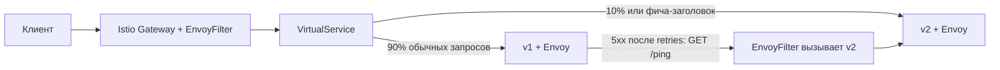

# Task5: управление трафиком с Istio

Сервис и Helm-чарт скопированы из task4 и расширены двумя версиями. Task4 продолжает работать в staging; task5 разворачивается в default.

## Что добавлено

- `booking-service-v1` и `booking-service-v2`: отдельные Deployment с метками `app=booking-service` и `version=v1/v2`.
- Общий Service `booking-service` выбирает обе версии по app; DestinationRule выделяет subsets по version.
- В каждый под автоматически добавляется Envoy sidecar. Gateway принимает запросы с Host `booking.task5.local`.
- VirtualService направляет обычные запросы на v1/v2 с весами 90/10.
- EnvoyFilter преобразует `X-Feature-Enabled: true` во внутренний маркер; приоритетный маршрут VirtualService направляет такой запрос на v2.
- В v2 `/feature` работает, если одновременно установлены `ENABLE_FEATURE_X=true` и заголовок `X-Feature-Enabled: true`. Без заголовка endpoint возвращает 404 даже на v2.
- Retry задаётся в VirtualService. DestinationRule содержит ограничения соединений и запросов, лимит одновременных retries и outlier detection.
- Для доказательства retry/circuit breaking включены дополнительные счётчики Envoy на ingressgateway. Patch в `results/gateway-stats-patch.yaml` обновляет аннотацию конфигурации прокси; первое применение перезапускает gateway.
- При окончательной ошибке 5xx на GET `/ping` EnvoyFilter обращается к subset v2 и возвращает его ответ с `X-Task5-Fallback: v2`.



## Подготовка и запуск

Нужны Docker, Minikube, Helm, kubectl, istioctl, make, Bash, curl и jq. Версия istioctl должна соответствовать установленному Istio.

```bash
minikube start --driver=docker
cd tasks/task5
make setup-istio
make build test load-to-minikube deploy
```

Если istioctl не находится в PATH, укажите путь, например:

```bash
make setup-istio ISTIOCTL=/home/dmitriy/istio-1.30.3/bin/istioctl
```

`setup-istio.sh` использует существующую mesh. Если Istio отсутствует, выполняет `istioctl install --set profile=demo -y`. Затем включает `istio-injection=enabled` в default.

Один образ собирается с двумя тегами `task5-v1` и `task5-v2`. Версия приложения задаётся через `SERVICE_VERSION`; фича-флаг выключен в v1 и включён в v2. Для повторного выпуска можно использовать уникальный префикс тега:

```bash
make build test load-to-minikube deploy IMAGE_TAG=task5-$(date -u +%Y%m%d-%H%M%S)
```

## Доступ через Istio

В отдельном терминале:

```bash
make port-forward
```

В другом терминале:

```bash
curl -i -H 'Host: booking.task5.local' http://localhost:9090/ping
curl -i -H 'Host: booking.task5.local' -H 'X-Feature-Enabled: true' http://localhost:9090/ping
curl -i -H 'Host: booking.task5.local' -H 'X-Feature-Enabled: true' http://localhost:9090/feature
```

Обычный запрос возвращает `pong v1` или `pong v2`. С фича-заголовком `/ping` всегда возвращает `pong v2`, а `/feature` — `Feature X is enabled!`.

Важно обращаться к ingressgateway. Port-forward напрямую на booking-service обходит Gateway и его EnvoyFilter; он не проверяет правила внешней маршрутизации.

## Проверки

При работающем port-forward выполните:

```bash
make check
make status check-dns
```

- `check-istio.sh` проверяет инъекцию, готовность Deployment и наличие sidecar.
- `check-canary.sh` отправляет 1000 запросов и считает доли ответов v1/v2. Это вероятностное распределение: допустим диапазон 5–15% для v2.
- `check-feature-flag.sh` проверяет 20 запросов на v2, доступность функции и её отключение без заголовка или с false.
- `check-fallback.sh` сначала вызывает диагностическую ошибку v1 через `X-Demo-Failure: true`, проверяет fallback и рост счётчиков retries/ejections Envoy. Затем временно масштабирует v1 до нуля и проверяет ответы v2. EXIT trap восстанавливает исходное число реплик, в том числе при ошибке теста.

Удалять один под для проверки отказа недостаточно: Deployment сразу создаст замену. Масштабирование до нуля гарантирует отсутствие v1 на время проверки.

Скрипты HTTP-проверок принимают переменные `BASE_URL` и `HOST`; canary также принимает `REQUESTS` (минимум 100).

## Как устроены retry, circuit breaker и fallback

Retry повторяет запрос при ошибке в пределах выбранного subset: до двух дополнительных попыток, по 2 секунды каждая. Он не переключает автоматически v1 на v2.

После трёх последовательных ошибок 5xx outlier detection временно исключает проблемный endpoint на 10 секунд. Connection pool ограничивает число соединений, активных и ожидающих запросов.

Fallback реализован отдельно через Lua в EnvoyFilter. Он повторяет только безопасный GET `/ping`; HTTP 4xx, запросы к `/feature` и операции изменения данных не перенаправляются. Если v2 тоже возвращает ошибку, исходная ошибка сохраняется. Фича-запросы, уже направленные на v2, не запускают fallback.

В исходном задании retries упомянуты в DestinationRule. Фактическое место HTTP-политики retry — VirtualService; `maxRetries` в DestinationRule ограничивает параллельные retries и не задаёт число попыток.

## Переключение по заголовку простыми словами

HTTP-заголовок — дополнительная информация рядом с адресом запроса. Например, клиент просит: «для этого запроса включи новую функцию»:

```bash
curl -H 'Host: booking.task5.local' -H 'X-Feature-Enabled: true' http://localhost:9090/feature
```

Envoy читает этот заголовок и отправляет запрос на v2 вместо случайного выбора 90/10. Только этот запрос получает новую функцию. Такой механизм позволяет проверять новую версию отдельными запросами без включения функции для всех пользователей.

## Результаты

В `results/` находятся исходные values и Istio-конфигурации, отчёт и логи фактических проверок. Эти конфигурации используются непосредственно командой `make deploy`.
